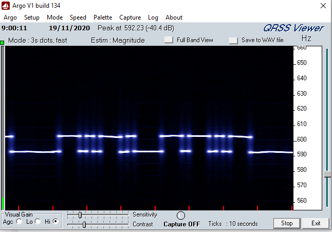

# Multimode radio beacon
> - Make sure that you comply with local radio regulations before building and deploying this.
> - I make no claims with regards to electrical safety, RF safety, EMC compatibility or compliance to standards of any kind.

This is a radio beacon for the modes WSPR and QRRS (FSK-CW, CW). The beacon is built around an STM32 and a AD9850 DDS. It works by driving directly the DDS in order to implement the different modulations (frequecy shift keying and ON/OF keying). Having all the components at hand, the beacon can be put to work at least in one mode in a weekend and completed under a couple.

## Implementation
### [Software](https://github.com/jaesparza/radio-beacon/tree/main/sw/beacon)

The software is written in C++ and compiled using the arduino platform. No additional libraries are needed.

Initialization and entry point are in `beacon.ino`. QRSS and WSPR modes are defined and implemented in their respective classes. Very simple and straightforward code, feel free to mofify it to suit your needs.

### Hardware
```
Writing on progress...
```

## Calibrating the oscillator with an external frequency counter 

1. Set the oscillator to the desired frequency f.
```C
#define _10MHZ 10000000 // 10MHz calibration signal
oscillator->setFrequency(_10MHZ);
```
2. Turn on the frequency counter and let it be powered for a period of time so the reference estabilizes. Connect the frequency counter to the oscillator output.
3. Take readout from the frequency counter and substract desired frequency. Assign that value to de `CALIBRATION` define.
```C
#define CALIBRATION  100 // [Hz] Hardcoded calibration factor for the oscillator
```
4. Repeat from step 1 until the oscillator is as close as possible to the target frequency.

I have been able to get the oscillator tuned to 10MHz with a deviation of 0.4 Hz. Measured with a Racal frequency counter with ovenized reference.

## Puting the beacon on the air
The beacon can be configured with a custom message, TX frequency, shift and transmission time. The process is as follows:

1. Define the message to be sent under the desired mode.
2. Set the band and the shift around the transmission frequency.
3. Set the delay between transmissions in seconds.
4. Beacon will transmit periodically.

```C
#define CW_MESSAGE   "OZ/EA2ECV OZ/EA2ECV QTH COPENHAGEN DK 73"
#define _30_M_QRSS 10140000 // 10MHz
#define SHIFT 0 // [Hz]
```

For FSK-CW transmission, the process is the same. A separate message will have to be defined:
```C
#define QRSS_MESSAGE "CQ OZ/EA2ECV"
```
Additionally, the QRSS timing can be configured through the following definitions in the QRSS.h file. It is a must to configure it to suit your needs.
```C
#define QRSS_DOT    2000 // Duration of a dot in milliseconds
#define QRSS_WEIGHT 3 // Dash-dot weight, DASH duration = QRSS_DOT * QRSS_WEIGHT
#define QRSS_DELAY  2000 // Time delay after keying a letter

#define FSK_HIGH 10 // Frequency shift used in the keying 
```
The snapshot below shows the start of `QRSS_MESSAGE` being transmmited in FSK-CW as captured locally by Argo. The transmission of 'CQ' alone took 60s under this configuration. This transmission was performed without an amplifier, coming directly from a wire connected to the AD9850 oscillator.

