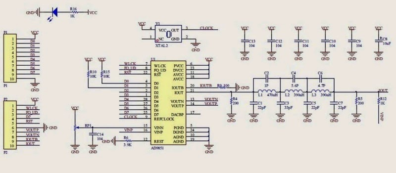
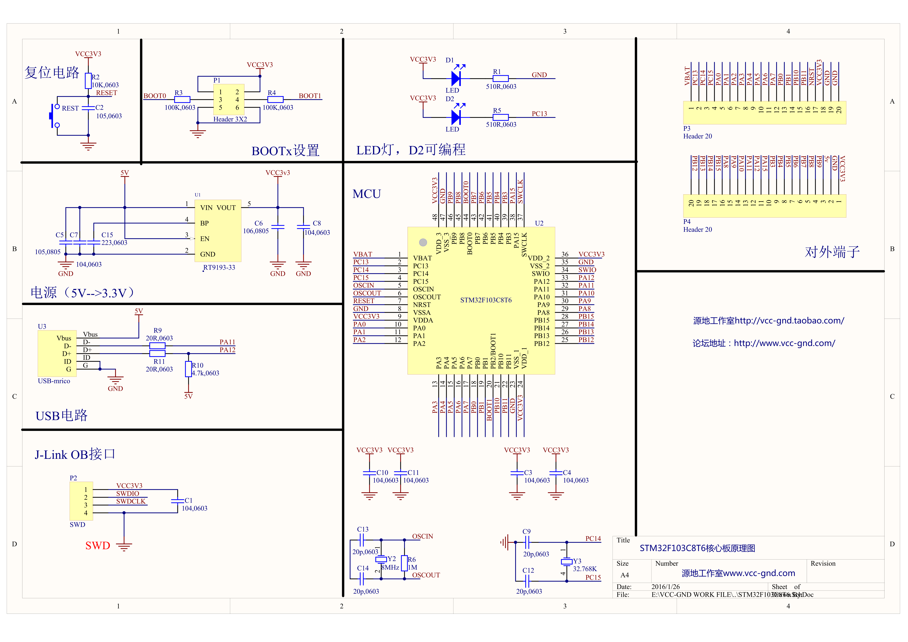
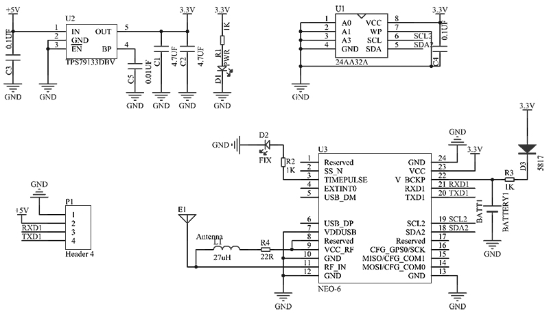

## References

* [Blue Pill STM32F103C8T6 data in STM32 base](https://stm32-base.org/boards/STM32F103C8T6-Blue-Pill.html)
* [AN3371 Using the STM32 hardware real-time clock (RTC)](https://www.st.com/content/ccc/resource/technical/document/application_note/7a/9c/de/da/84/e7/47/8a/DM00025071.pdf/files/DM00025071.pdf/jcr:content/translations/en.DM00025071.pdf)
* [NEO-6 u-blox 6 GPS Module datasheet](https://www.u-blox.com/sites/default/files/products/documents/NEO-6_DataSheet_%28GPS.G6-HW-09005%29.pdf)

## Schematics

### AD9850 Schematic

### STM32 Bluepill

### GPS breakout board

